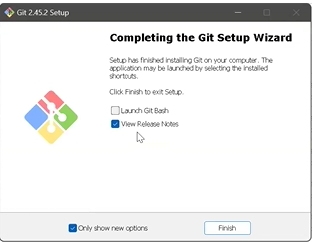

[](https://classroom.github.com/a/vbnbTt5m)
[](https://classroom.github.com/online_ide?assignment_repo_id=15281450&assignment_repo_type=AssignmentRepo)
# Dev_Setup
Setup Development Environment

#Assignment: Setting Up Your Developer Environment

#Objective:
This assignment aims to familiarize you with the tools and configurations necessary to set up an efficient developer environment for software engineering projects. Completing this assignment will give you the skills required to set up a robust and productive workspace conducive to coding, debugging, version control, and collaboration.

#Tasks:

1. Select Your Operating System (OS):
   Choose an operating system that best suits your preferences and project requirements. Download and Install Windows 11. https://www.microsoft.com/software-download/windows11

  
  
  

2. Install a Text Editor or Integrated Development Environment (IDE):
   Select and install a text editor or IDE suitable for your programming languages and workflow. Download and Install Visual Studio Code. https://code.visualstudio.com/Download


3. Set Up Version Control System:
   Install Git and configure it on your local machine. Create a GitHub account for hosting your repositories. Initialize a Git repository for your project and make your first commit. https://github.com





4. Install Necessary Programming Languages and Runtimes:
  Instal Python from http://wwww.python.org programming language required for your project and install their respective compilers, interpreters, or runtimes. Ensure you have the necessary tools to build and execute your code.


5. Install Package Managers:
   If applicable, install package managers like pip (Python).


6. Configure a Database (MySQL):
   Download and install MySQL database. https://dev.mysql.com/downloads/windows/installer/5.7.html
   
   

7. Set Up Development Environments and Virtualization (Optional):
   Consider using virtualization tools like Docker or virtual machines to isolate project dependencies and ensure consistent environments across different machines.

   

8. Explore Extensions and Plugins:
   Explore available extensions, plugins, and add-ons for your chosen text editor or IDE to enhance functionality, such as syntax highlighting, linting, code formatting, and version control integration.
   
   
   
   
   
  

9. Document Your Setup:
    Create a comprehensive document outlining the steps you've taken to set up your developer environment. Include any configurations, customizations, or troubleshooting steps encountered during the process. 
# Developer Environment Setup for Flutter App

## Introduction
This document provides a step-by-step guide for setting up a developer environment on [Operating System] for developing a Flutter application. It covers the installation and configuration of essential tools, frameworks, and dependencies required for Flutter development.

## Prerequisites
- A computer running [Operating System] (Windows, macOS, or Linux)
- An internet connection for downloading required software

## Setup Steps

### 1. Install Flutter SDK
- Visit the official Flutter website: https://flutter.dev/docs/get-started/install
- Download the latest stable version of Flutter SDK for your operating system
- Follow the installation instructions provided on the website

### 2. Set up an Integrated Development Environment (IDE)
- Install Android Studio or Visual Studio Code (recommended IDEs for Flutter development)
  - For Android Studio:
    - Visit the official website: https://developer.android.com/studio
    - Download the latest version for your operating system
    - Install Android Studio by following the prompts in the installer
    - Install the Flutter and Dart plugins within Android Studio
  - For Visual Studio Code:
    - Visit the official website: https://code.visualstudio.com/
    - Download the latest version for your operating system
    - Install Visual Studio Code by following the prompts in the installer
    - Install the Flutter and Dart extensions within Visual Studio Code

### 3. Set up Android Studio (for Android app development)
- Install the latest version of Android Studio
- Install the Android SDK
- Configure Android device emulators or connect a physical Android device

### 4. Set up Xcode (for iOS app development, macOS only)
- Install the latest version of Xcode from the App Store
- Configure iOS simulators or connect a physical iOS device

### 5. Install Flutter Dependencies
- Run the following command in your terminal or command prompt to install the required dependencies:
  ```
  flutter doctor
  ```
- Follow the instructions provided by the `flutter doctor` command to resolve any issues or missing dependencies

### 6. Create a New Flutter Project
- Open your IDE (Android Studio or Visual Studio Code)
- Create a new Flutter project by following the prompts in the IDE

### 7. Run Your Flutter App
- In your IDE, locate the main.dart file (the entry point of your Flutter app)
- Run the app by clicking the appropriate run button or using the command:
  ```
  flutter run
  ```
- Select the target device (emulator, simulator, or physical device) to run the app

## Troubleshooting
- If you encounter issues during the setup process, refer to the official Flutter documentation for troubleshooting steps: https://flutter.dev/docs/get-started/install/troubleshooting

## Additional Resources
- Flutter Documentation: https://flutter.dev/docs
- Flutter Codelabs: https://flutter.dev/docs/codelabs
- Flutter Samples: https://flutter.dev/docs/samples-and-tutorials

## Conclusion
Congratulations! You have successfully set up your developer environment for developing Flutter applications. If you encounter any issues or have additional questions, please refer to the official Flutter documentation or reach out to the Flutter community for assistance.
#Deliverables:
- Document detailing the setup process with step-by-step instructions and screenshots where necessary.
- A GitHub repository containing a sample project initialized with Git and any necessary configuration files (e.g., .gitignore).
- A reflection on the challenges faced during setup and strategies employed to overcome them.

#Submission:
Submit your document and GitHub repository link through the designated platform or email to the instructor by the specified deadline.

#Evaluation Criteria:**
- Completeness and accuracy of setup documentation.
- Effectiveness of version control implementation.
- Appropriateness of tools selected for the project requirements.
- Clarity of reflection on challenges and solutions encountered.
- Adherence to submission guidelines and deadlines.

Note: Feel free to reach out for clarification or assistance with any aspect of the assignment.
